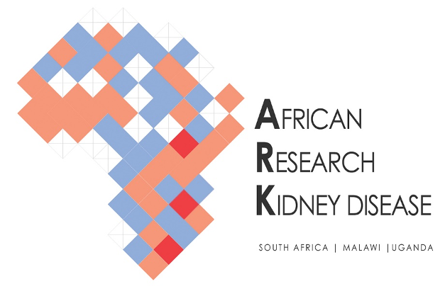

#The African Research on Kidney Disease (ARK) Consortium 

 

This GitHub page contains code, input and output data associated with the [ARK study]. For a description of the study design refer to the published protocol paper (https://doi.org/10.1186/s12882-020-1688-0).

## Measurement of kidney function in Malawi, South Africa, and Uganda: a multi centre cohort study

**Authors:** June Fabian*, Robert Kalyesubula*, Joseph Mkandawire, Christian Holm Hansen, Dorothea Nitsch, Eustasius Musenge, Wisdom P Nakanga, Josephine E Prynn, Gavin Dreyer, Tracy Snyman, Billy Ssebunnya, Michele Ramsay, Liam Smeeth, Stephen Tollman, Saraladevi Naicker, Amelia Crampin, Robert Newton, Jaya A George, Laurie Tomlinson, on behalf of the ARK Consortium. *Joint first authors

**Programming contributor:** Paris Baptiste

### About the study
The African Research on Kidney Disease (ARK) Consortium  is a multicentre partnership between Malawi, South Africa, Uganda, and the United Kingdom. The study sites for the ARK Consortium are nested within population cohorts hosted by the Malawi Epidemiology and Intervention Research Unit (MEIRU), the Medical Research Council/Uganda Virus Research Institute (MRC/UVRI) and London School of Hygiene and Tropical Medicine (LSHTM) Uganda Research Unit; and the Medical Research Council/Wits University Rural Public Health and Health Transitions Research Unit, South Africa. 
Our primary objectives were to determine chronic kidney disease (CKD) prevalence (estimated from serum creatinine), identify associated risk factors, and investigate the most accurate way to assess kidney function in African populations. Each partner country conducted their own population-based study to determine CKD prevalence and associated risk factors: Malawi (N=5264); South Africa (N=2020); and Uganda (N=5979). These cohorts comprised the source from which we sampled the *Iohexol Measured GFR Study.* 

***The Iohexol Measured GFR Study*** 
The target sample size for each country was 1000 participants, stratified by eGFR stage and sex to ensure representation of all stages of CKD. The sample size was based on a power calculation for the number of study participants needed to examine the accuracy of eGFR equations for predicting iohexol (measured) GFR in each country. We specified this using the paired t-test and a correlation coefficient of 0·5 for 90% power to detect whether eGFR is within 5% of iohexol GFR at an eGFR of 60mls/min, assuming a standard deviation of 25mls/mins and a two-sided α=0·05. This gave an estimated required sample size of 730 participants, however, to allow for participants who did not wish to participate and technical and screening failures, we oversampled to 1000 /country. 
Deidentified participant data from the three ARK Consortium partner countries are presented in this data repository. The variables included are those needed to calculate iohexol measured GFR adjusted for body surface area (BSA)(mL/min/1·73m2) from plasma clearance of iohexol using the slope-intercept method for three time points (using the exact time of measurement of the samples intended to be taken at 120, 180 and 240 minutes) in the second (slow) exponential phase of iohexol elimination. The extrapolated y-intercept is the calculated concentration of iohexol at time zero, and the coefficient, k, is the slope of the semilog plot of plasma iohexol concentration against time [P(t)=P0 exp(–kt)]. We adjusted for body surface area using the Haycock formula [BSA = 0·024265*Wt0·5378 * Ht0·3964] followed by the Bröchner-Mortensen (BM) correction for adults, to account for iohexol plasma clearance in the first (rapid) exponential phase [BM = (0·9908*GFR) – (0·001218*GFR2)]. Variables have also been included to estimate GFR using various creatinine- and cystatin C based equations. 

### Statistical analysis SAS code and datasets
- **ARKinput.sas7bdat:** this is the input dataset (SAS format) with measurements from the three countries, N= 3025
- **ARKinput.csv:** comma-separated version of the above file
- **ARKinput_final.sas7bdat:** this is the input dataset (SAS format) that only contains the N=2578 participants in the final study sample, i.e. this is the dataset after applying filters and inclusion/exclusion.
- **ARKinput_final.csv:** comma-separated version of the above file 
- **ARKoutput.sas7bdat:** this is the resulting dataset after running the program code. It contains all the original input iohexol data etc as well as the mGFR and eGFR values
- **ARKprog.sas:** this is the SAS program code
- **ARKprog_final.sas:** this is the same as the above except without the datastep that applies the filters /exclusion/inclusion criteria to arrive at the final dataset. In other words, this is the program that goes with the ARKinput_final.sas7bdat input dataset. 
- **Sumcreat.sas7bdat:** this is the input dataset containing the population creatinine values needed for the FAS equation
- **Sumcreat.csv:** this is the comma-separated version of the above file
 
